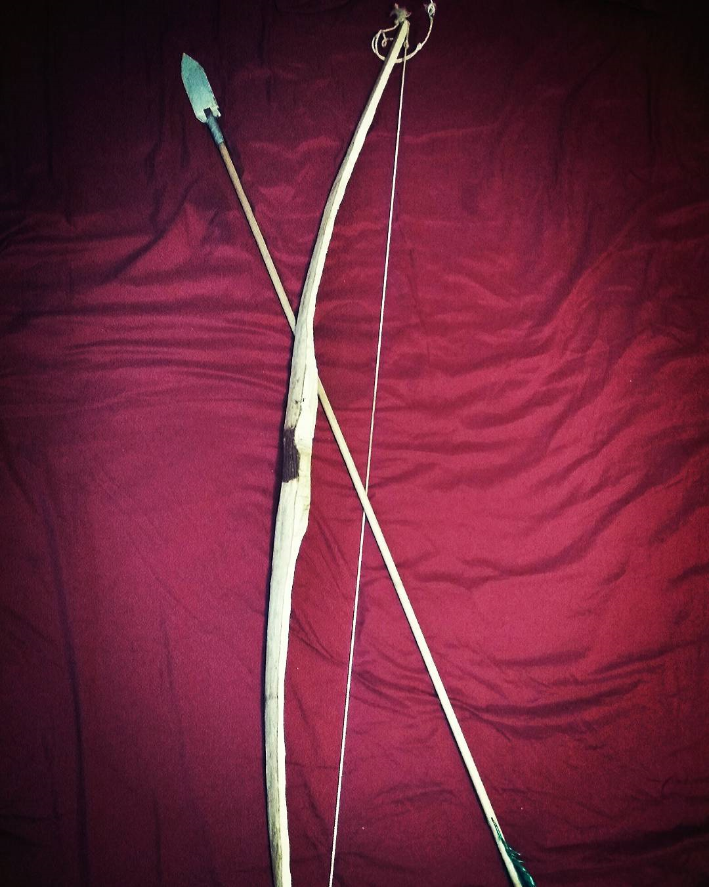
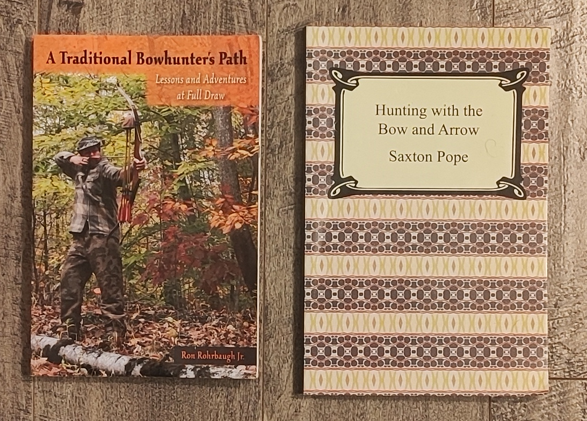

## Archery
If you suspect that my interest in archery is related to my interest in [Native American Anthropology](link), you are correct. 
After I reading many stories and biographies of Amerindian archers, I became interested in Archery. And how could I not? 
After reading accounts of people such as Moawa, who was so skillful he took down over 20 enemies with the bow, 
Fusiwe, who was so stoic he did not even let out a shout of pain when he was killed with arrows, 
and Ishi, a knowledgeable hunter who could harvest anything from a from a squirrel to a grizzly bear, any young boy would want to become an archer himself.  

As a teenager, I introduced myself to archery by manually constructing the bows and arrows myself, and practicing shooting with my custom-made equipment.
Crafting bows and arrows was a peaceful and relaxing experience. 

&nbsp;

<figure>
    

    
    <figcaption>One of the bows and arrows I made. I should have taken more photos of the process.</figcaption>
    

</figure>

&nbsp;

For the curious, here is a brief summary of how I made them.

Bow:

1.	Wood: I harvested the log from live hardwood trees in nearby forests. The sections were chosen to be as straight as possible, and free of knots or branches.
2.	Shape: I shave the log into a bow with an axe. The shape is designed to make the bow as light as possible, but still be able to pull my draw weight at my draw length. According to my crude teenage math, this meant that the ends should taper, and pull strength should be maintained by keeping wood in the direction parallel to the axis of rotation/torque (keep bow thick), rather than perpendicular (keep bow wide). 
3.	Recurve: The highest performing bows are recurved, because they store more energy given the same draw weight and draw distance (LINK EXPLANATION). I recurved some of my bows by bending the ends under hot steam, and letting them cool and solidify in the new shape. 

Arrows:

1.	Shaft: I modified wooden dowels purchased from hardware stores. 
2.	Arrow Head: Some of the woods were so hard I just could just razor the tip of the shaft, turning it into a makeshift head.  Usually though I used steel heads, purchasing the steel myself, shaping it with metal grinders, and sharpening it with files.
3.	Bindings: Glue and fishing line.
4.	Fletching: Plastic leaves act as feathers.

&nbsp;

<figure>
    

    
    <figcaption>My archery books</figcaption>
    

</figure>

&nbsp;

I also enjoyed learning about primitive hunting. In my teenage years I successfully stalk and struck animals such as small birds, ducks and even salmon (amazing memories). Fortunately, most animals were not seriously hurt. The bow was too weak, arrows dulled too easily, and the flight mechanics were off. Now that I’m older, I think this may have been illegal (laughing).

&nbsp;

[Back to home](https://ceudan.github.io/Ceudan_Reads.github.io/)
