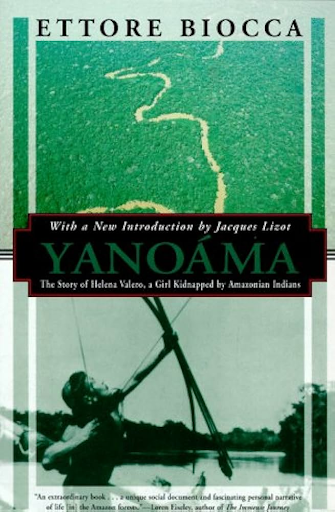

## Native American Anthropology
In my teens I read a book that affected my interests permanently. “Yanoama: The Story of Helena Valero, a Girl Kidnapped by Amazonian Indians” is the biography of a woman in the early 1900’s, 
recounting her life of 20 years spent living alongside uncontacted indigenous tribes. Helena tells of hunter-gatherer life in the forest, the customs, beliefs and rituals of Yanoama culture, 
and the relationships and wars between individuals and groups. The book is unique due the incredible episodic memory of the author. She recounts exact details, such as conversations that took place, 
the calls of hunters and animals, or songs sang by the dying.

What I liked about this book is the portrayal of an ancient lifestyle so different, but also more interesting than our own monotonic and relatively safe lives. We purchase food while they catch it, we work jobs while they are nomadic, 
we depend on the state for safety while for them every man is a warrior. I recommend it to anyone. 

&nbsp;

  

&nbsp;

After this book I further pursued the topic by buying more biographies of similar taste. I also read countless articles on hunter-gatherer anthropology, human migrations, and their effects on human genetic evolution.

&nbsp;

&nbsp;

At one point I tried to democratize my knowledge in these topics by sharing it on my [Quora Account](https://www.quora.com/profile/Ray-Coden-Mercurius). Unfortunately I did not recieve much attention, so I quit Quora 😂. 
